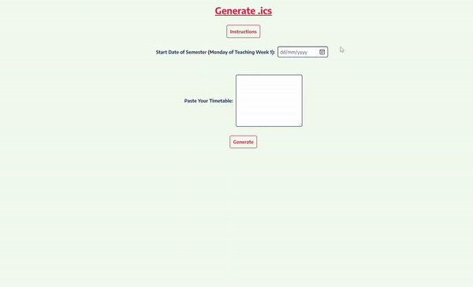

# Import NTU Timetable to Outlook Calendar

## [Live Website:](https://ntu-calendar.tjh.sg/)

## Implementation:

- JavaScript
  - Parse the text pasted by user and convert it into ics format

## **Instructions:**

1. **`Go`** to the **degree audit page.** Find the link to the degree audit page on the [StudentLink page.](https://venus2.wis.ntu.edu.sg/intulinks/ug/login.aspx)

2. **`Scroll` to the bottom** of the degree audit page and select the year and semester and click on **"View course timetable"**

   

3. **`Copy`** from the **top left to the bottom right** of the table (The table heading is not required)

   

4. **`Paste`** the timetable into the form when you close this instruction page

5. Select the **`start date`** of the semester (**Monday** of teaching week 1)

6. You can check the academic calendar [here](https://www.ntu.edu.sg/admissions/matriculation/academic-calendars)

7. **`Click` on the `Generate` button**

8. The ics file will start **downloading**

9. **`Drag and drop`** the ics file directly into your outlook calendar to import it
