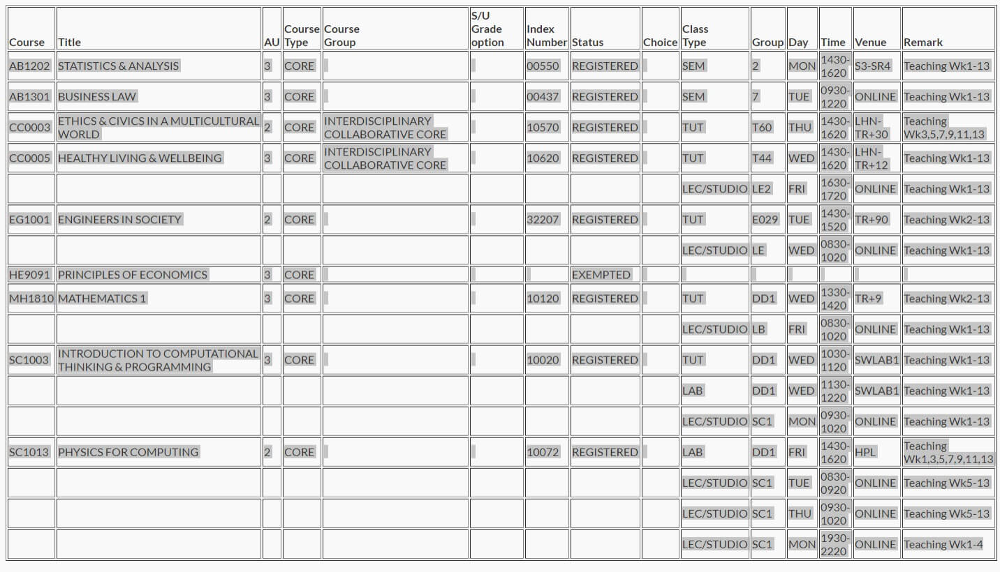

<h2 align="center">NTU Class Schedule Generator for Calendar</h2>

<p align="center">

</p>

<h4 align="center">Creates calendar schedule events from NTU timetable</h4>

<p align="center">
<a href="https://github.com/ztjhz/generate_class_schedule_ics/blob/master/LICENSE" target="blank">

</a>
<a href="https://github.com/ztjhz/generate_class_schedule_ics/fork" target="blank">

</a>
<a href="https://github.com/ztjhz/generate_class_schedule_ics/stargazers" target="blank">

</a>
<a href="https://github.com/ztjhz/generate_class_schedule_ics/issues" target="blank">

</a>
<a href="https://github.com/ztjhz/generate_class_schedule_ics/pulls" target="blank">

</a>
<a href="https://twitter.com/intent/tweet?text=👋%20Check%20this%20amazing%20repo%20https://github.com/ztjhz/generate_class_schedule_ics,%20created%20by%20@nikushii_"></a>
</p>

<p align="center">
    <a href="https://ntu-calendar.tjh.sg">View Demo</a>
    ·
    <a href="https://github.com/ztjhz/generate_class_schedule_ics/issues/new/choose">Report Bug</a>
    ·
    <a href="https://github.com/ztjhz/generate_class_schedule_ics/issues/new/choose">Request Feature</a>
</p>

## 👋🏻 Introducing `NTU Class Schedule Generator for Calendar`


`NTU Class Schedule Generator for Calendar` converts Nanyang Technological University (NTU) timetable into an [iCalendar](https://en.wikipedia.org/wiki/ICalendar) (Internet Calendaring and Scheduling Core Object Specification).

This iCalendar can then be imported into various calendars such as Outlook, Google Calendar, Apple Calendar, and many more!

## 🚀 Demo

Here is a quick demo of the app. We hope you enjoy it.

> [The Demo Link](https://ntu-calendar.tjh.sg)

Liked it? Please give a ⭐️ to <b>NTU Class Schedule Generator for Calendar</b>.

_Many Thanks to all the `Stargazers` who has supported this project with stars(⭐)_

[](https://github.com/ztjhz/generate_class_schedule_ics/stargazers#gh-light-mode-only)

[](https://github.com/ztjhz/generate_class_schedule_ics/stargazers#gh-dark-mode-only)

## 🔥 Features

`NTU Class Schedule Generator for Calendar` comes with a bundle of features already. You can do the followings with it,

- 📅 Customise the semester start date
- 📋 Paste your NTU timetable directly in text format
- 📱 Responsive and mobile-friendly

## 📚 How to use `NTU Class Schedule Generator for Calendar`

1. `Go` to the **degree audit page.** Find the link to the degree audit page on the [StudentLink page.](https://venus2.wis.ntu.edu.sg/intulinks/ug/login.aspx)

2. `Scroll` to the bottom of the degree audit page and select the year and semester and click on **"View course timetable"**

   

3. `Copy` from the **top left to the bottom right** of the table (The table heading is not required)

   

4. `Paste` the timetable into the form when you close this instruction page

5. Select the `start date` of the semester (**Monday** of teaching week 1)

6. You can check the academic calendar [here](https://www.ntu.edu.sg/admissions/matriculation/academic-calendars)

7. `Click` on the `Generate` button

8. The ics file will start downloading

9. `Drag and drop` the ics file directly into your outlook calendar to import it

## 🏗️ How to Set up `NTU Class Schedule Generator for Calendar` for Development?

1. Clone the repository

```bash
git clone https://github.com/ztjhz/generate_class_schedule_ics.git
```

2. Change the working directory

```bash
cd generate_class_schedule_ics
```

3. Install the node packages

```bash
npm install
```

4. Run the development server

```bash
npm run serve
```

That's All!!! Now open [localhost:8080](http://localhost:8080/) to see the app.
